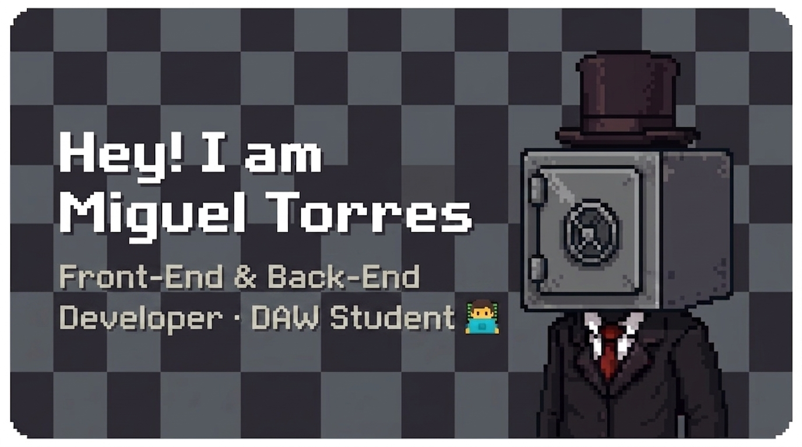
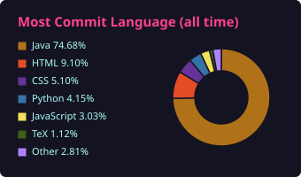

  

  <i>"I like to do small projects of everything in general, I think it is the best way to learn something new."</i> 
  <code>¯\_(ツ)_/¯</code>

---

### 🧭 About Me

- 📚 Currently studying the **Higher Level Vocational Training in Web Page Development** at Celia Viñas.
- 🌱 I'm always learning new things like **Java**, **JavaScript**, **CSS**, and **SQL**.
- ⚙️ I love building small projects. It's my absolute favorite way to grasp new technologies!
- 🕹️ Deeply passionate about the world of **Indie Video Game Development**.

---

### 🛠️ Languages & Tools
<table align="center">
  <tr>
    <td align="center" valign="middle" width="96" height="80">
      
    </td>
    <td align="center" valign="middle" width="96" height="80">
      
    </td>
    <td align="center" valign="middle" width="96" height="80">
      
    </td>
    <td align="center" valign="middle" width="96" height="80">
      
    </td>
    <td align="center" valign="middle" width="96" height="80">
      
    </td>
    <td align="center" valign="middle" width="96" height="80">
      
    </td>
    <td align="center" valign="middle" width="96" height="80">
      
    </td>
    <td align="center" valign="middle" width="96" height="80">
      
    </td>
    <td align="center" valign="middle" width="96" height="80">
      
    </td>
  </tr>
  <tr>
    <td align="center" valign="top">Java</td>
    <td align="center" valign="top">Spring&nbsp;Boot</td>
    <td align="center" valign="top">FXGL</td>
    <td align="center" valign="top">JavaScript</td>
    <td align="center" valign="top">Python</td>
    <td align="center" valign="top">MySQL</td>
    <td align="center" valign="top">Sass</td>
    <td align="center" valign="top">Docker</td>
    <td align="center" valign="top">GitHub</td>
  </tr>
</table>

---

### 📊 GitHub Activity

  

  

